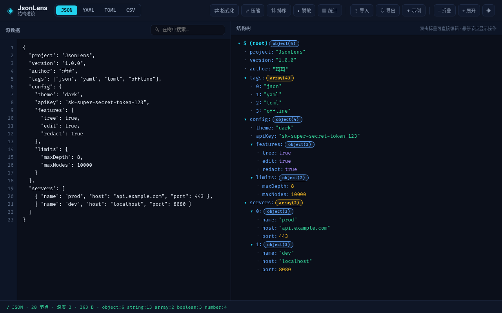
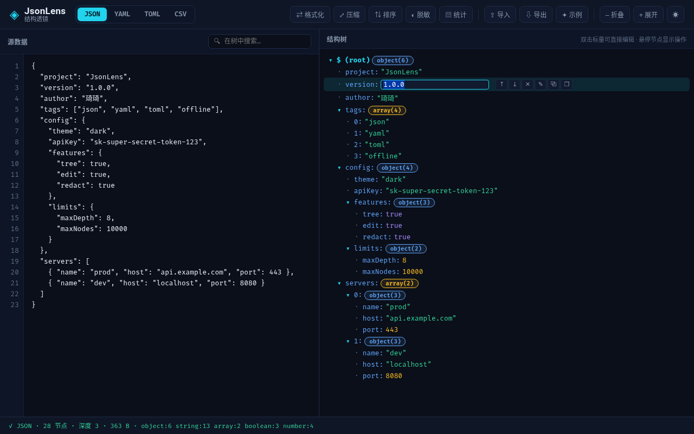
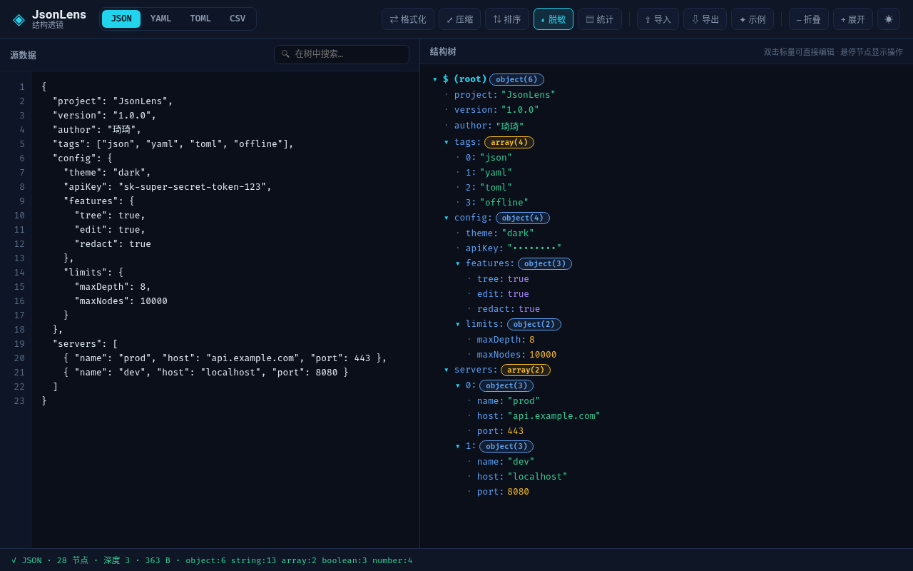

# ◈ JsonLens · 结构透镜

> 🌐 **语言 / Language**：<a href="#/">简体中文</a> · <a href="README.zh-TW.md">繁體中文</a> · <a href="README.en.md">English</a>

**JsonLens** 是一款 **零依赖、可离线、浏览器端运行的 JSON / YAML / TOML / CSV 结构可视化与智能编辑工作台**。它把复杂的数据文件渲染成可折叠的彩色结构树，让你既能「一眼看懂」，又能「直接编辑」——而这一切都发生在本机浏览器里，**数据不出本地，绝不上传云端**。🔒

> 🐣 **灵感来源**：`jless` 这类终端工具只能「看」不能「改」，`jq` 又需要写过滤器、学习曲线陡峭；而在线 JSON 查看器会把你的敏感配置传到第三方服务器。JsonLens 填补了「**本地可视化 + 可编辑 + 多格式互转**」这个空白，开箱即用、隐私无忧。

---

## ✨ 核心特性

- 🗂️ **多格式解析与互转**：原生支持 **JSON / YAML / TOML / CSV** 四种格式，一键互相转换，数据无损往返。
- 🌳 **彩色结构树**：对象/数组自动折叠，按类型着色（字符串🟢 / 数字🟠 / 布尔🟣 / null⚪），嵌套层级一目了然。
- ✏️ **可视化直接编辑**：双击任意标量即可内联修改，节点支持 **新增 / 删除 / 上移 / 下移**，所见即所得。
- 🔍 **智能搜索高亮**：在树中实时搜索并高亮匹配节点，快速定位深层数据。
- ◐ **敏感值脱敏**：一键把 `password`、`apiKey`、`token` 等敏感字段打码为 `••••••••`，演示分享更安心。**重点加粗**。
- 📊 **结构统计面板**：实时统计节点总数、最大深度、数据大小、类型分布，洞察数据全貌。
- 🔧 **格式化 / 压缩 / 排序**：一键格式化缩进、压缩为单行、按键名排序，满足不同场景。
- ⧉ **JSONPath 复制**：悬停节点即可复制精确的 JSONPath 路径或节点值，方便对接脚本与代码。
- 🎨 **深色 / 浅色主题**：一键切换，护眼舒适，适配不同环境。
- 💾 **导入 / 导出 / 拖拽**：支持文件导入、导出下载、拖放文件自动识别格式，交互丝滑。
- 🚫 **完全离线**：单文件即可运行，无构建、无依赖、无网络请求，甚至可断网使用。

---

## 🚀 快速开始

### 📦 环境要求

- 任意现代浏览器（Chrome / Edge / Firefox / Safari）
- （可选）Node.js ≥ 16 用于本地起服务
- **无需安装任何依赖**，无需 `npm install`

### 🏃 方式一：直接打开（最快）

克隆或用任意方式获取源码后，直接双击打开 `index.html` 即可使用：

```bash
git clone https://github.com/gitstq/JsonLens.git
cd JsonLens
open index.html        # macOS
start index.html       # Windows
xdg-open index.html    # Linux
```

### 🖥️ 方式二：本地起服务（推荐）

```bash
cd JsonLens
npm start              # 自动在 http://localhost:8080 启动
# 或使用 Node 直接运行
node server.js --port 8080
```

浏览器访问 **http://localhost:8080** 即可。

### 🐍 方式三：Python 简易服务

```bash
cd JsonLens
python3 -m http.server 8000
# 访问 http://localhost:8000
```

---

## 📖 详细使用指南

### 1️⃣ 数据结构树

打开应用后，左侧「源数据」面板已预填一份示例 JSON。右侧「结构树」会实时渲染为彩色树形：点击 `▾/▸` 可展开折叠，悬停任意节点会浮现操作按钮（上移 / 下移 / 删除 / 新增 / 复制路径 / 复制值）。



### 2️⃣ 编辑数据

- **修改标量**：双击某个值（如 `"1.0.0"`），进入内联输入框，回车确认、`Esc` 取消。
- **新增子项**：悬停对象/数组节点，点击 `＋` 按钮。
- **删除 / 移动**：悬停节点点击 `✕` 删除，`⤒ / ⤓` 上移下移。



### 3️⃣ 格式切换与互转

顶部 **JSON / YAML / TOML / CSV** 标签可随时切换。切换时 JsonLens 会先解析当前数据，再无损序列化为目标格式，**数据不会丢失**。这非常适合用 YAML 写配置、用 JSON 传接口、用 CSV 做表格的场景。

| 场景 | 推荐格式 |
|------|----------|
| 接口调试 / 程序配置 | JSON |
| 运维 / CI 配置文件 | YAML |
| Rust / 现代工具配置 | TOML |
| 表格数据 / 批量导入 | CSV |

### 4️⃣ 脱敏与隐私

点击工具栏 **◐ 脱敏** 按钮，`password`、`apiKey`、`token`、`secret` 等关键字段会自动打码，方便在分享截图或演示时保护敏感信息。再次点击可恢复。



### 5️⃣ 统计与搜索

- **▤ 统计**：弹出节点总数、最大深度、数据大小、类型分布。
- **🔍 搜索**：在结构树顶部的搜索框输入关键词，实时高亮匹配节点。

---

## 💡 设计思路与迭代规划

### 设计理念

JsonLens 坚持 **「零依赖、离线优先、隐私第一」** 的核心理念。所有解析器（YAML / TOML / CSV）均为 **自研实现**，不依赖任何第三方库，因此可以做到单文件直开、完全离线、数据不出浏览器。界面遵循「数据透镜」实验室美学——深色底、霓虹高亮、克制排版，让数据本身成为主角。

### 技术选型

- **原生 HTML / CSS / JavaScript（ES Modules）**：零构建、零依赖，任何一个能打开网页的设备都能运行。
- **自研解析器**：覆盖常见 YAML 子集（嵌套映射、序列、内联数组/映射、块标量、注释）、TOML（表、数组表、内联表、基础类型）、CSV（带表头/无表头）。
- **Node 内置测试运行器**：无需额外依赖即可运行单元测试，保障解析器正确性。

### 迭代规划

- [ ] 支持 JSON Schema 校验与错误提示
- [ ] 增加主题色可自定义
- [ ] 支持更多格式（XML / INI / Properties）
- [ ] 差异对比（diff）视图
- [ ] 大文件虚拟滚动优化

### 社区贡献方向

欢迎提交新的格式支持、解析器增强、UI 体验优化、国际化翻译等。详见 [贡献指南](CONTRIBUTING.md)。

---

## 📦 打包与部署指南

### 构建产物

```bash
cd JsonLens
npm run build        # 生成自包含的 dist/ 目录
python3 -m http.server 8000 --directory dist
```

### 部署方式

- **静态托管**：将 `dist/` 目录上传到 GitHub Pages、Netlify、Vercel、Nginx 等任意静态托管，即可获得在线访问地址。
- **内网 / 离线部署**：将 `dist/` 拷贝到任意内网服务器或本地即可离线使用，无需网络。
- **桌面使用**：直接双击 `index.html`，无需任何服务端。

### 兼容环境

| 浏览器 | 版本 |
|--------|------|
| Chrome / Edge | 80+ |
| Firefox | 78+ |
| Safari | 14+ |
| Node.js（可选） | ≥ 16 |

---

## 🤝 贡献指南

- 🐛 发现 Bug 或异常行为，请通过 [Issues](../../issues) 反馈，附上复现步骤与环境信息。
- 💡 有功能建议或新的格式支持需求，欢迎开 Issue 讨论。
- 🔧 想提交代码，请 Fork 后创建 PR，遵循 [提交规范](CONTRIBUTING.md)（Angular Commit Convention）。
- 🌐 欢迎参与文档翻译与多语言支持。

---

## 📄 开源协议

本项目基于 **MIT License** 开源，可自由使用、修改、商用与再分发。详见 [LICENSE](LICENSE)。

⭐ 如果 JsonLens 帮助到了你，欢迎点个 Star，也欢迎分享给需要的朋友！